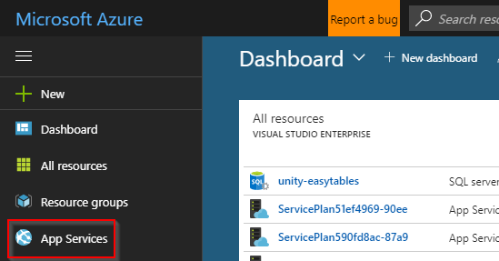
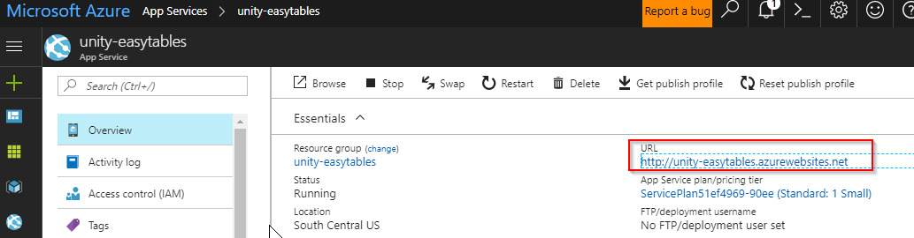

# Implement the Azure MobileServiceClient

Central to the Azure Mobile Client SDK is the <a href="https://msdn.microsoft.com/en-us/library/azure/microsoft.windowsazure.mobileservices.mobileserviceclient(v=azure.10).aspx">MobileServiceClient</a>, which allows access to your Mobile App backend.

## Locate the URL of the Mobile App backend

The `MobileServiceClient` constructor takes the Mobile App URL as a parameter, so before going forward, locate the URL.

1. In the Azure portal, click the **App Services** button.

    

2. Click the entry for your Mobile App.

    

3. Copy the URL of your Mobile App backend.

    

## Create the MobileServiceClient singleton

There should only be a single instance of `MobileServiceClient`, so the walkthrough uses a variation of the singleton pattern.

1. Inside of the **Assets/Scripts** directory of your Unity project, create a new C# script named **AzureMobileServiceClient**.

2. Open the `AzureMobileServiceClient` script and delete any existing template code, including using statements and the class declaration.

3. Add the following code:

  ```csharp
  using Microsoft.WindowsAzure.MobileServices;

  public static class AzureMobileServiceClient
  {
      // Either use mozroots / cert-syc to update your Unity Mono certificate store,
      // or set ignoreTls to true to ignore security certificate errors.
      private const bool ignoreTls = true;
      private const string backendUrl = "MOBILE_APP_URL";
      private static MobileServiceClient client;

      public static MobileServiceClient Client
      {
          get
          {
              if (client == null)
              {
                  if (ignoreTls)
                  {
                      System.Net.ServicePointManager.ServerCertificateValidationCallback = (a, b, c, d) => { return true; };
                  }
                  client = new MobileServiceClient(backendUrl);
              }

              return client;
          }
      }
  }
  ```

  > [!NOTE]
  > If IntelliSense does not recognize the Microsoft.WindowsAzure namespace, check that you have completed all of the steps in the [Prepare the development environment]() section.

4. In the preceding code, replace `MOBILE_APP_URL` with the URL of your Mobile App backend.

> [!NOTE]
> The comment about the Unity Mono certificate store is explained in a subsequent section of the walkthrough. For now, just leave `ignoreTls` as true.
