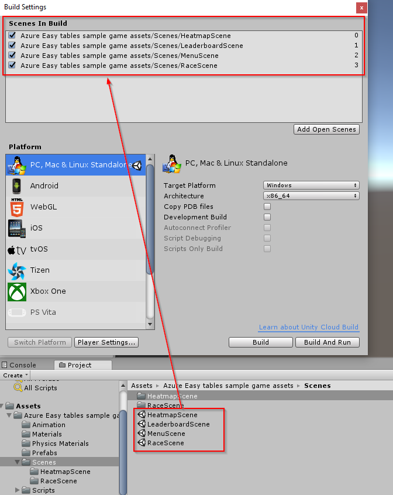

# Import sample game assets

Now that the core functionality has been tested and demonstrated to work, it's time to import the sample game assets.

## Import package

1. Download the [sample game assets package](https://github.com/dantogno/UnityAzureSample/blob/master/Azure%20Easy%20tables%20sample%20game%20assets.unitypackage).

2. Ensure your Unity project is open, then navigate to the download location and double click the file. This will bring up the import dialog in Unity.

3. Click **All** and then click **Import**. Wait for the resulting progress bars to complete.

  

## Add scenes to Build Settings

Once the files have completed importing, the required scene files must be added in the Unity project's Build Settings.

1. In the Unity Project window, navigate to the **Azure Easy tables sample game assets/Scenes** directory.

2. From the Unity menu, select **File > Build Settings...**. This will display the Build Settings dialog.

3. Drag the **HeatmapScene**, **LeaderboardScene**, **MenuScene**, and **RaceScene** files from the Project window into the **Scenes In Build** section of the Build Settings dialog.

  

4. From the Unity menu, select **File > Save Project** to ensure the build settings are saved.

## Next steps

* [Test the sample game](Test%20the%20sample%20game.md)
