# Setup table schema
Now that you have a Mobile App on Azure with Easy tables initialized, it's time to build the tables that will keep track of data sent from a Unity game.

## Setup the crash heatmap table

1. In the Azure portal, click All resources and then select the Mobile App that you configured for Easy tables in the previous steps.

  

2. Scroll down to the **MOBILE** heading and select **Easy tables**. There should no longer be any notice about initializing your app for Easy tables.  

  

3. Click the **Add** button.

  

4. Name the table "**CrashInfo**" and click **OK**. Leave the rest of the options with their default settings.

  >**Note:** This name must match the name of the data model class created later in the walkthrough.

  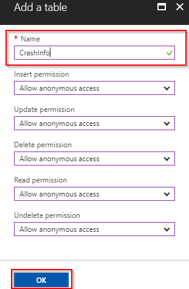

5. A notification will announce when the new table has been created. Click on the newly created CrashInfo table in the Easy tables blade.

  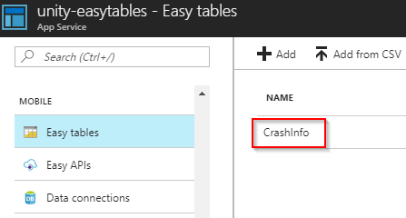

6. With the CrashInfo table open, click the **Manage schema** button. For the heatmap feature, the game will record crash info with x, y, and z coordinate data about where the player crashes. The table schema must be modified to reflect this.

  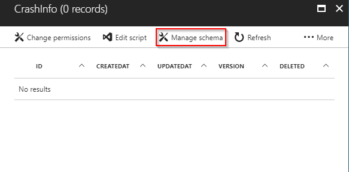

7. Click the **Add a column** button. Note that some columns are present by default, such as **id**.

  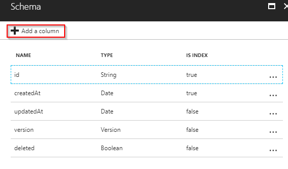

8. Name the column "**x**", change the data type to **Number** and click **OK**.

  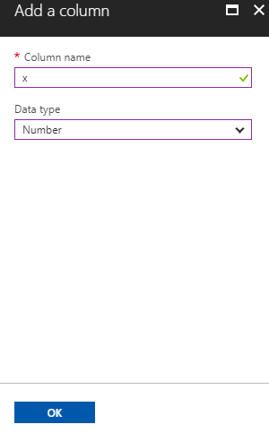

9. Repeat this process to create two additional number data type columns named **y** and **z**.

  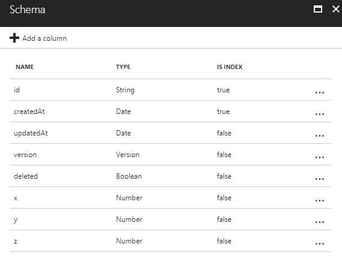

## Setup the leaderboard table

1. Go back to the Easy tables blade and click **Add** to add a second table.

  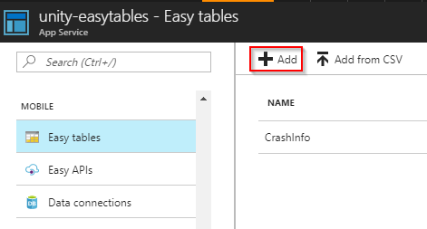

2. Name the new table "**HighScoreInfo**" and click **OK**. Leave the rest of the options at their default settings.

  >**Note:** This name must match the name of the data model class created later in the walkthrough.

  

3. A notification will announce when the new table has been created. Click on the newly created **HighScoreInfo** table in the Easy tables blade.

  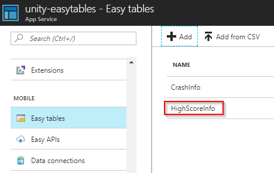

4. With the HighScoreInfo table open, click the **Manage schema** button. For the leaderboard feature, the game will record player names and lap times. The table schema must be modified to reflect this.

  

5. Click the **Add a column** button.

  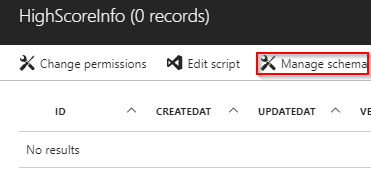

6. Name the column "**name**", set the data type to **string** and click **OK**.

  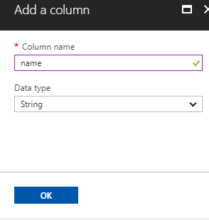

7. Repeat this process to create a new **number** data type column named **time**.

  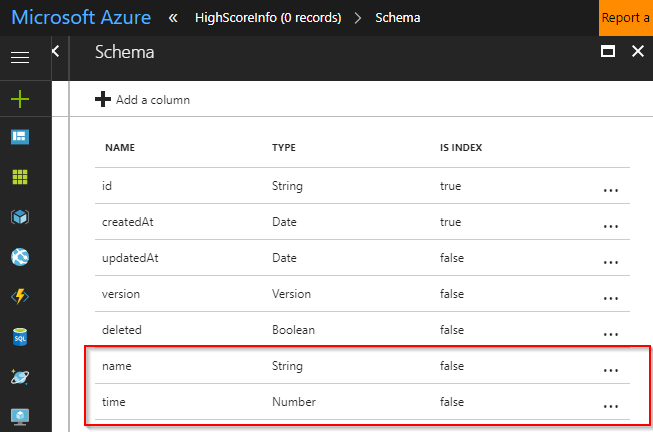

## Conclusion
This concludes Easy table setup in the Azure portal. The next sections will cover setting up a sample project in Unity that can read and write to Azure Easy tables.
