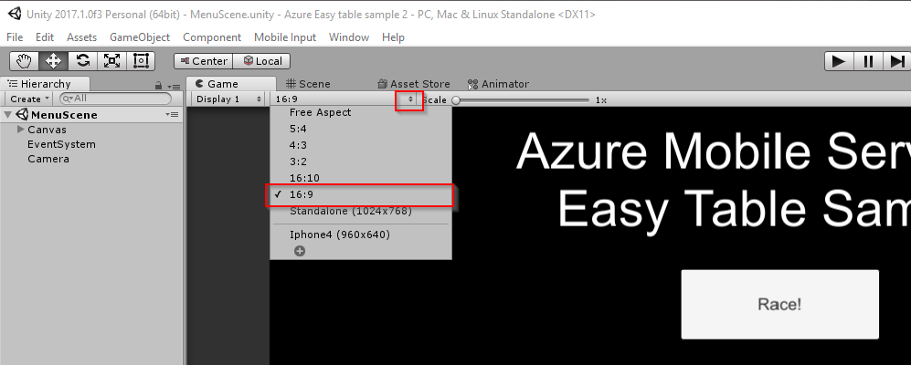
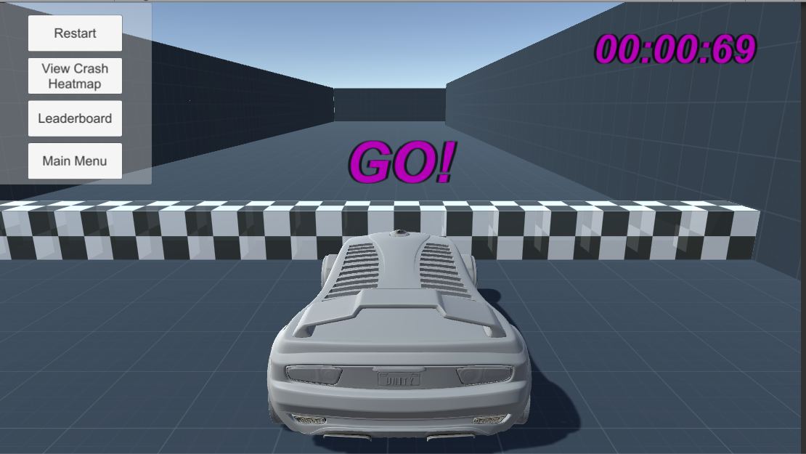
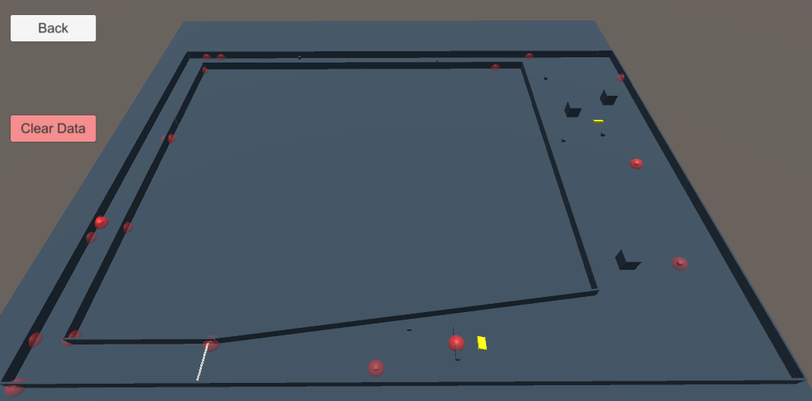
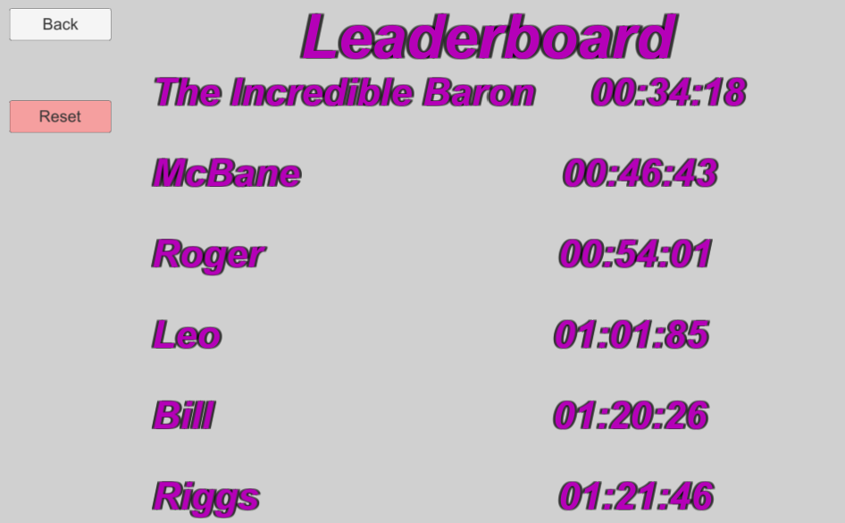

# Test the sample game

The sample game is a simple racing game that records data about the player's behavior and stores it in Azure Easy tables. The sample game also includes scenes that read the data from Azure and visualize it for the player.

This section will simply explain how to play the sample game and ensure it's functioning correctly. The next sections will go into more detail explaining how the sample game works.

## Starting the game

1. In the Unity Project window, navigate to the **Assets/Azure Easy tables sample game assets/Scenes** folder.

2. Double click the **MenuScene** to open it.

3. In the Unity Game window, click the **aspect ratio dropdown** and choose **16:9**.

  

4. Click the **Play** button to run the game in the Unity editor.

## Complete a race

Before viewing the leaderboard or heatmap, it's best to create some sample data by completing the race at least once.

1. With the game running in the Unity editor, click the **Race!** button to start a new race.

2. Use **WASD** or the **arrow keys** to drive the car and complete a clockwise lap around the track. For the sake of example, be sure to crash into some walls along the way. Debug output in the Unity console should indicate when a collision has been recorded.

  * If you manage to flip the car and are unable to continue, click **Restart**.

  

3. After crossing the checkered finish line, the game should display a **Finished** message. At this point, crash data will be uploaded to Azure.

4. If you have completed one of the top 10 fastest lap times, you will be prompted to enter a name for a high score. Enter your name and click **Submit**.

  

## View the heatmap

1. Click the **View Crash Heatmap** button from the race scene or select **Crash Heatmap** from the main menu.

2. The heatmap scene loads data from the CrashInfo table in Azure and displays a transparent red sphere at locations where players have collided with the walls of the race track. If multiple crashes occur in an overlapping area, the spheres should appear brighter.

  

## View the leaderboard

1. Click the **Leaderboard** button from the race scene or main menu.

2. The leaderboard scene loads high score data from the HighScoreInfo table in Azure and displays a player name and lap time for each high score entry.

  

## Next steps

* [RaceScene explanation](RaceScene%20explanation.md)
